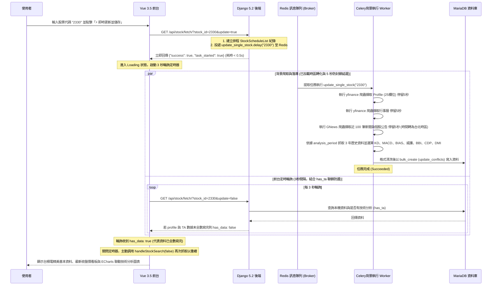

# 台股搜尋、儲存與定時排程系統逐步解說 (walkthrough_details.md)

本文件詳細說明了「台股公司基本資料 (Profile) 與技術分析 (Technical Analysis) 搜尋、儲存、背景排程與戰情室系統」的架構時序、各組件程式與設定檔之實作細節。

---

## 🚀 1. 異步非同步爬取、防封鎖延遲與輪詢時序架構

在 GNews RSS 和 yfinance RSS 資料抓取時，由於呼叫了大量的外部網路請求，若是在 HTTP 連線中同步等待，通常耗時會超過 30 秒，極易引發 HTTP Timeout 或 Apache 502/504 錯誤。

因此，本系統設計了**「非同步 Celery 任務分派 + 前端 3 秒間隔動態輪詢 + has_ta 聯合校驗 + 二次抓取」**的無阻塞架構，並在所有網路擷取方法中加入延遲，以最大程度防範封鎖：

---

## 🌐 2. 路由分開與雙網頁呈現設計

我們分開了「戰情室（台股基本資料）」與「系統檢測（健康監控）」的路由，並在 Apache 與前端做了解耦：

### 1. Apache 反向代理路由轉接 ([httpd-custom.conf](file:///home/dengkai/projects/financial-information/apache/httpd-custom.conf))
Apache 在 Port 80 監聽，並依據 Location 進行代理重寫與轉接（支援帶斜線與無斜線格式）：
* `/tech-stack` 與 `/tech-stack/` -> 轉接至前端容器 `http://fin-frontend:5173/tech-stack/`。
* `/profile` 與 `/profile/` -> 轉接至前端容器 `http://fin-frontend:5173/tech-stack/` 搭配前端 setup 路由判定。

### 2. 前端路由解耦與 HMR 消除 ([App.vue](file:///home/dengkai/projects/financial-information/frontend/src/App.vue))
由於 Vite 配置的 `base` 為 `/tech-stack/`，而使用者訪問的路徑變為 `/profile/` 時會產生 **Pathname Mismatch**，導致 Vite 客戶端反覆引發 reload 重刷。我們在 [vite.config.ts](file:///home/dengkai/projects/financial-information/frontend/vite.config.ts) 中將 `hmr` 設為 `false` 停用熱重載，完全解決了重刷問題。

---

## 📦 3. DataTables 分頁與 12pt 最小字體強制限制

* **DataTables 詳情頁整合**：
  * 在 `/stock/calendar/<stock_id>/` 與 `/stock/news/<stock_id>/` 詳情分頁中，加載了 jQuery 與 DataTables 插件。
  * 對 DataTables 插件控制項（快速搜尋框、每頁筆數下拉選單、分頁按鈕）加載了符合系統戰情風格的霓虹深色主題 CSS。
* **12pt 最小字體強制**：
  * 在前台網頁的樣式表中對所有小字體類別（`.text-xs`, `.text-sm`）統一覆寫強制最小為 `12pt !important` (16px)，保障所有小字體均清晰可讀。

---

## 📅 4. Celery Beat 定期任務調度

* 後端使用了 `django-celery-beat` 套件，在 [entrypoint.sh](file:///home/dengkai/projects/financial-information/backend/entrypoint.sh) 啟動時自動校正並寫入排程任務。
* 定期任務排程頻率改為**每 4 小時**執行一次更新。
* 在任務 `update_all_scheduled_stocks()` 中，遍歷排程股票時，每隻個股之間設置了 **10 秒的休眠間隔** (`time.sleep(10)`)，極大地提高了自動爬取的防封鎖安全性。
