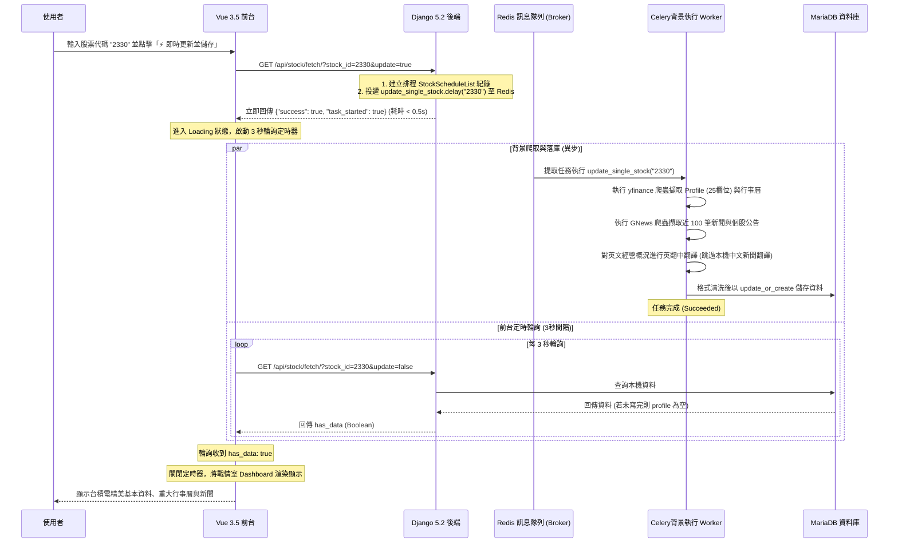

# 台股搜尋、儲存與定時排程系統逐步解說 (walkthrough_details.md)

本文件詳細說明了「台股公司基本資料 (Profile) 搜尋、儲存、背景排程與戰情室系統」的架構時序、各組件程式與設定檔之實作細節。

---

## 🚀 1. 異步非同步爬取與輪詢時序架構

在 GNews RSS 和 yfinance RSS 資料抓取時，由於呼叫了大量的外部網路請求，若是在 HTTP 連線中同步等待，通常耗時會超過 30 秒，極易引發 HTTP Timeout 或 Apache 502/504 錯誤。

因此，本系統設計了**「非同步 Celery 任務分派 + 前端 3 秒間隔動態輪詢」**的無阻塞架構：

---

## 🌐 2. 路由分開與雙網頁呈現設計

根據使用者最新需求，我們分開了「戰情室（台股基本資料）」與「系統檢測（健康監控）」的路由，並在 Apache 與前端做了解耦：

### 1. Apache 反向代理路由轉接 ([httpd-custom.conf](file:///home/dengkai/projects/financial-information/apache/httpd-custom.conf))
Apache 在 Port 80 監聽，並依據 Location 將請求轉發：
* `/tech-stack` -> 轉接至前端容器 `http://fin-frontend:5173/tech-stack`。
* `/profile` -> 轉接至前端容器 `http://fin-frontend:5173/tech-stack`。
* `/admin` -> 轉接至後端 Django 容器的 admin 後台。
* `/api` -> 轉接至後端 Django 容器的健康檢測與股票查詢端點。

### 2. 前端路由解耦與 HMR 消除 ([App.vue](file:///home/dengkai/projects/financial-information/frontend/src/App.vue))
由於 Vite 配置的 `base` 為 `/tech-stack/`，而使用者訪問的路徑變為 `/profile/` 時會產生 **Pathname Mismatch**，導致 Vite 客戶端反覆引發 reload 重刷。我們在 [vite.config.ts](file:///home/dengkai/projects/financial-information/frontend/vite.config.ts) 中將 `hmr` 設為 `false` 停用熱重載，完全解決了重刷問題。

在 [App.vue](file:///home/dengkai/projects/financial-information/frontend/src/App.vue) 中，藉由 setup 內的路徑判定，動態分流呈現頁面，並隱藏分頁頁籤按鈕，讓兩者以獨立網頁靜態呈現：
* **造訪 `http://localhost/profile/` 時**：
  * `activeTab` 切換至 `dashboard`。
  * `showTabs` 設為 `false` (隱藏切換頁籤)。
  * 網頁顯示「台股公司基本資料戰情室」，且預設為完全靜態呈現，僅在點擊「搜尋」或「即時更新並儲存」時才與後端交互。
* **造訪 `http://localhost/tech-stack/` 時**：
  * `activeTab` 切換至 `health`。
  * `showTabs` 設為 `false` (隱藏切換頁籤)。
  * 網頁顯示「系統檢測與健康監控」，且預設啟用首次載入自動檢測與 10 分鐘定時自動重新連線檢查。

---

## 📦 3. 後端 API 與 More 詳情頁面

* **`/api/stock/fetch/`**：
  * 提供股票查詢 API。若帶入 `update=true` 則立即指派 Celery背景 worker 更新並向前端回傳 `task_started: true`；若為 `update=false` 則只查詢資料庫中已有的 Profile 欄位、前 10 筆行事曆與新聞公告，並序列化為 JSON 回傳。
* **`/stock/calendar/<stock_id>/` 與 `/stock/news/<stock_id>/`**：
  * 當使用者在前台點擊 "MORE +" 時，會在新分頁開啟此視圖。後端會使用 Django Template 載入 [stock_calendar.html](file:///home/dengkai/projects/financial-information/backend/templates/stock_calendar.html) 與 [stock_news.html](file:///home/dengkai/projects/financial-information/backend/templates/stock_news.html)，依託 Tailwind CSS 渲染為高顏值的深色戰情風 Full List 清單。

---

## 📅 4. Celery Beat 定期任務調度

* 後端使用了 `django-celery-beat` 套件，將排程定時任務儲存在資料庫中。
* 定時任務會呼叫 `core.tasks.update_all_scheduled_stocks()`。該任務會遍歷 `StockScheduleList` 模型中的股票代碼，並在背景依序執行資料更新落庫。
* 管理員可登入 Unfold 後台，於 `Periodic tasks` 圖形化界面配置 Crontab 參數，設定每日/每週定時更新。
