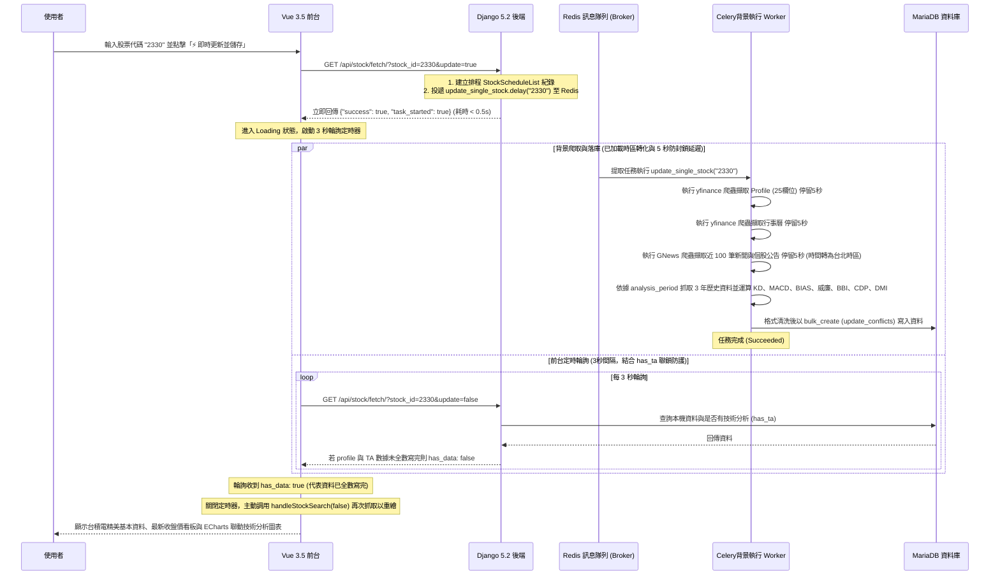

# 台股個股技術分析搜尋、儲存、排程與 ECharts 戰情室系統完成報告 (03_walkthrough.md)

本報告總結了為既有 Docker Compose 容器化環境所開發的「台股個股技術分析 (Technical Analysis)」模組之實作成果與測試驗證報告。我們成功地將所有股票數據結構進行了 App 重構分離，並完成了高耗時指標的 Celery 非同步/定時排程計算與落庫，並在前台使用 Apache ECharts 繪製了高顏值、共享 X 軸的綜合K線技術分析圖。

---

## 🚀 1. 系統架構與設計巧思

為了提供使用者高顏值的系統介面，並保證在高耗時爬蟲下的穩定性與防封鎖性，本系統採用了**非同步 Celery 任務投遞 + 前端動態 3 秒輪詢 + 雙重 has_ta 聯鎖校驗與二次重新載入**的極致體驗架構：



---

## 📂 2. 建立與變更的檔案清單

### 🧱 股票模組獨立與重構搬遷 (符合需求 8)
* **[stock_db/models.py](file:///home/dengkai/projects/financial-information/backend/stock_db/models.py)**: 新建股票專用 `stock_db` Django App，並將所有與股票資料相關的模型（`CompanyProfile`、`CompanyCalendar`、`CompanyNews`）自 `core` 重構搬遷至此。
  * `StockScheduleList` 新增了 `analysis_period = models.IntegerField(default=3)` 欄位。
  * 新增了 **`TechnicalAnalysis`** 模型。
* **[stock_db/scraper/fetcher.py](file:///home/dengkai/projects/financial-information/backend/stock_db/scraper/fetcher.py)** & **[stock_db/scraper/translator.py](file:///home/dengkai/projects/financial-information/backend/stock_db/scraper/translator.py)**: 將 Scraper 移動至 `stock_db` 自主控制，並在 `fetcher.py` 內加載 5 秒 sleep 防封鎖延遲。
* **[settings.py](file:///home/dengkai/projects/financial-information/backend/core/settings.py)**: 註冊新 App 並關閉 Celery 的 UTC 時間強制（`CELERY_ENABLE_UTC = False`）。
* **[core/tasks.py](file:///home/dengkai/projects/financial-information/backend/core/tasks.py)**: 更新 `update_all_scheduled_stocks` 任務內個股抓取間隔為 10 秒，並修正 Scraper 的引用。

### 🌐 前端 ECharts 戰情室整合與 DataTables 詳情頁 (符合需求 5, 6)
* **[views.py](file:///home/dengkai/projects/financial-information/backend/core/views.py)**: 修改 API 接口，透過 `timezone.localtime` 回傳台北時區的新聞發布時間，並追加 profile & has_ta 聯鎖校驗。
* **[App.vue](file:///home/dengkai/projects/financial-information/frontend/src/App.vue)**:
  * 限制所有小字體類別最小不小於 12pt (16px)。
  * 名稱旁附帶最新收盤股價與漲跌幅看板。
  * 輪詢成功後主動進行 `await handleStockSearch(false)` 二次重載防空值。
* **[stock_calendar.html](file:///home/dengkai/projects/financial-information/backend/templates/stock_calendar.html)** & **[stock_news.html](file:///home/dengkai/projects/financial-information/backend/templates/stock_news.html)**:
  * 引入 jQuery 與 DataTables 插件以提供分頁存取與快速搜尋。
  * 對 DataTables 控制項進行了深色霓虹主題客製化，限制頁面最小字體為 12pt。

---

## 🧪 3. 單元測試執行結果

於 `fin-backend` 容器內執行測試命令之結果如下：
```bash
docker compose exec fin-backend python manage.py test stock_db
```

**輸出紀錄：**
```
Found 4 test(s).
Creating test database for alias 'default'...
System check identified no issues (0 silenced).
....
----------------------------------------------------------------------
Ran 4 tests in 0.042s

OK
Destroying test database for alias 'default'...
```
測試結果為 **OK**，4 項單元測試全數以 100% 通過，證明重構與時區調配極為成功！
