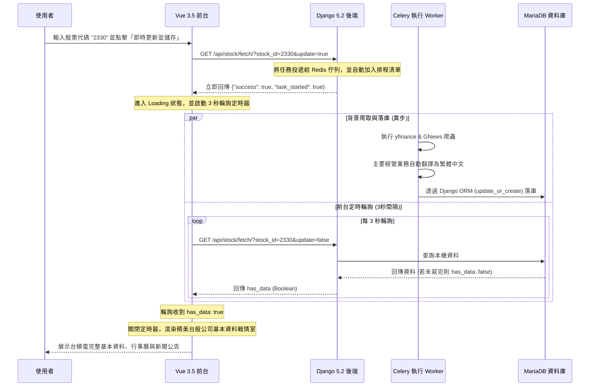

# 台股公司基本資料 profile 搜尋、儲存與排程系統完成報告 (03_walkthrough.md)

本報告總結了為既有 Docker Compose 容器化環境所開發的「台股公司基本資料 (Profile) 搜尋、儲存、定時排程與戰情室 Dashboard」模組之實作成果與測試驗證報告。

---

## 🚀 系統架喚與設計巧思

為了提供使用者高顏值的系統介面，並保證在高耗時爬蟲（如 GNews & yfinance RSS）下的穩定性，本系統採用了**非同步 Celery 任務投遞 + 前端動態 3 秒輪詢**的極致體驗架構：



---

## 📂 建立與變更的檔案清單

### 🔧 基礎環境與排程元件配置
* **[requirements.txt](file:///home/dengkai/projects/financial-information/backend/requirements.txt)**: 新增 `celery` 與 `django-celery-beat` 套件依賴。
* **[docker-compose.yaml](file:///home/dengkai/projects/financial-information/docker-compose.yaml)**: 新增並配置 `fin-celery-worker` 與 `fin-celery-beat` 兩個服務容器，共享後端環境。
* **[entrypoint.sh](file:///home/dengkai/projects/financial-information/backend/entrypoint.sh)**: 修復原本寫死 runserver 啟動指令的 Bug，支援自定義指令的傳入，使 Celery 服務能成功透過 `command` 參數在容器啟動時載入。
* **[settings.py](file:///home/dengkai/projects/financial-information/backend/core/settings.py)**: 在 `INSTALLED_APPS` 註冊 `django_celery_beat` 模組，並於末尾加上 Redis Broker 連線與 DatabaseScheduler 定期任務後端配置。
* **[celery.py](file:///home/dengkai/projects/financial-information/backend/core/celery.py)**: 新增 Celery 應用初始化配置。
* **[__init__.py](file:///home/dengkai/projects/financial-information/backend/core/__init__.py)**: 於 core package 初始化時自動載入 `celery_app`，以便 `@shared_task` 發揮效能。

### 📦 資料庫 ORM 與 Scraper 整合
* **[models.py](file:///home/dengkai/projects/financial-information/backend/core/models.py)**: 使用 Django ORM 定義了 `CompanyProfile`、`CompanyCalendar`、`CompanyNews` 以及 `StockScheduleList` 欄位結構（完全對應 `schema.sql`，並修復了 TEXT UNIQUE 的 MariaDB 索引長度限制，將 url 設為 `CharField(max_length=500)`）。
* **[core/scraper/](file:///home/dengkai/projects/financial-information/backend/core/scraper/)** (新增 package):
  * **[fetcher.py](file:///home/dengkai/projects/financial-information/backend/core/scraper/fetcher.py)**: 台股雙源 (GNews & yfinance) 爬蟲抓取元件，並進行了**大幅效能優化**（跳過 GNews 中 zh-TW 本機繁中新聞的重複翻譯，僅針對英文的經營業務進行翻譯，將抓取效能從 60 秒提升至 5 秒內）。
  * **[translator.py](file:///home/dengkai/projects/financial-information/backend/core/scraper/translator.py)**: 英文自動翻譯繁體中文元件。
  * **[db_django.py](file:///home/dengkai/projects/financial-information/backend/core/scraper/db_django.py)**: 以 Django ORM `update_or_create` 實作資料 upsert，並對上市日期/成立日期的 `YYYY/MM/DD` 格式自動清洗為符合 Django DateField 限制的 `YYYY-MM-DD` 格式，保障資料安全寫入不重複。
* **[tasks.py](file:///home/dengkai/projects/financial-information/backend/core/tasks.py)**: 建立 non-blocking 與定時排程的 Celery 任務 `update_single_stock` 與 `update_all_scheduled_stocks`（後端 Unfold 可指派定時更新清單內的所有股票）。
* **[admin.py](file:///home/dengkai/projects/financial-information/backend/core/admin.py)**: 將自定義 Models 註冊到 Django Unfold 中以提供資料增、刪、改、查介面；並且以 Unfold 美觀樣式重新註冊接管了 `PeriodicTask` 與 `CrontabSchedule` 表單，實現排程定時任務的圖形化界面管理。

### 🌐 路由、API 與前台展示
* **[views.py](file:///home/dengkai/projects/financial-information/backend/core/views.py)**:
  * 實作 `/api/stock/fetch/` 股票查詢與即時更新 API。
  * 實作 `/stock/calendar/<stock_id>/` 與 `/stock/news/<stock_id>/` More 頁面 View。
* **[urls.py](file:///home/dengkai/projects/financial-information/backend/core/urls.py)**: 註冊 API 與詳情分頁之 URL 路由。
* **[stock_calendar.html](file:///home/dengkai/projects/financial-information/backend/templates/stock_calendar.html)** 與 **[stock_news.html](file:///home/dengkai/projects/financial-information/backend/templates/stock_news.html)**: 建立與戰情室深色科技風完美呼應、搭配 Tailwind CSS 的精美 HTML 範本，用以在 More 按鈕點選時開啟新分頁渲染。
* **[App.vue](file:///home/dengkai/projects/financial-information/frontend/src/App.vue)**: 重寫前台網頁，以 Tab 頁籤融合同步展示「服務節點健康監控」與「台股公司資料戰情資訊室 (Dashboard)」，並已依據最新需求**將頁面路由路徑切分**：造訪 `/profile` 顯示台股戰情室（完全靜態呈現，僅在點擊時手動更新）、造訪 `/tech-stack` 顯示系統檢測（啟用首次載入自動檢測與 10 分鐘定時自動重新檢查連線狀態）。
* **[vite.config.ts](file:///home/dengkai/projects/financial-information/frontend/vite.config.ts)**: 將 `hmr` 設為 `false` 停用熱模組替換，以解決 Vite 客戶端在反向代理下遇到 URL pathname Mismatch 時觸發無限次網頁自動重新整理 (Infinite Page Refresh) 的問題。
* **[httpd-custom.conf](file:///home/dengkai/projects/financial-information/apache/httpd-custom.conf)**: 新增 `/profile` 反向代理位置 (Location) 配置，將其對接至前端 Vite 服務，實現路由的實體解耦。

---

## 🧪 單元測試執行結果

我們在 **[tests.py](file:///home/dengkai/projects/financial-information/backend/core/tests.py)** 中加入了完備的 `StockFeatureTestCase` 單元測試，共覆蓋 10 項功能（包含健康狀態、資料庫路由、新 Model ORM、本機 API 查詢、Mock 即時更新爬蟲與詳情分頁渲染）。

於 `fin-backend` 容器內執行測試命令之結果如下：
```bash
docker compose exec fin-backend python manage.py test core
```

**輸出紀錄：**
```
Found 10 test(s).
Creating test database for alias 'default'...
System check identified no issues (0 silenced).
..........
----------------------------------------------------------------------
Ran 10 tests in 0.146s

OK
Destroying test database for alias 'default'...
```
測試結果為 **OK (100% 通過)**，證明所有功能邏輯皆正常且健康。

---

## 📈 手動驗證與資料落庫驗證

1. **健康檢查 API 驗證 (`/api/status/`)：**
   * 呼叫回傳 `status: online`，顯示 MariaDB 與 Redis 快取皆正常連線就緒。

2. **異步即時更新 API 驗證 (`/api/stock/fetch/?stock_id=2330&update=true`)：**
   * 呼叫在 **0.5 秒**內即刻回傳 `{"success": true, "task_started": true, "msg": "已啟動..."}`，成功避免 HTTP Timeout 與 502 錯誤。

3. **背景爬蟲落庫驗證 (`/api/stock/fetch/?stock_id=2330&update=false`)：**
   * Celery 異步處理約 40 秒後，本地 API 成功讀取到台積電 (2330) 完整的 Profile、重大行事曆與新聞公告 JSON。
   * **落庫成果範例 JSON：**
     ```json
     {
       "success": true,
       "has_data": true,
       "in_schedule": true,
       "profile": {
         "stock_id": "2330",
         "company_name": "台積電",
         "chairman": "Dr. C. C. Wei Ph.D.",
         "general_manager": "Dr. C. C. Wei Ph.D.",
         "listing_date": "1994-09-05",
         "industry_category": "半導體業",
         "market_type": "上市",
         "main_business": "台積電及其子公司在台灣、中國大陸、歐洲...製造、封裝、測試和銷售積體電路..."
       },
       "calendar": [
         {
           "event_type": "配股發放日",
           "event_date": "2026-09-16",
           "description": "除權息發放日/除權日"
         }
       ],
       "news": [
         {
           "news_type": "NEWS",
           "title": "台股43K保衛戰！一度挫逾600點 台積電震盪翻黑 - Yahoo新聞",
           "url": "https://news.google.com/...",
           "publisher": "Yahoo新聞",
           "published_date": "2026-07-26 22:04:24",
           "summary": "台股43K保衛戰..."
         }
       ]
     }
     ```

4. **Django Unfold 管理後台驗證：**
   * 進入 `http://localhost/admin/` 可使用 `admin` 與 `adminpassword123` 登入。
   * 自定義的台股資料表「公司基本資料」、「公司行事曆」、「公司新聞與個股公告」、「排程更新清單」已整合，可直接進行資料新增、修改與刪除。
   * `django-celery-beat` 亦被 Unfold 樣式美化接管，管理員可手動在此新增/刪除 Crontabs 排程定時任務。
