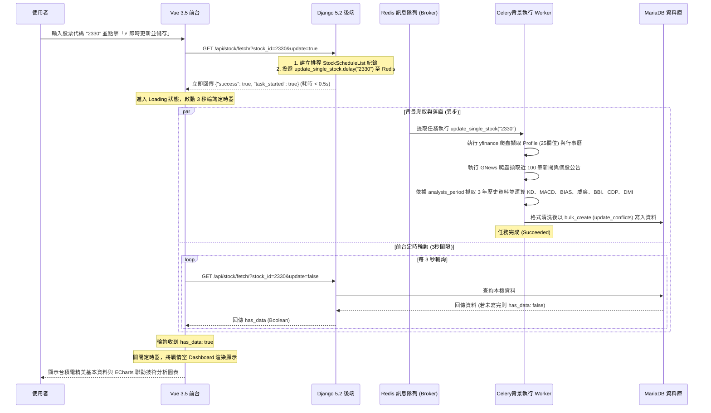

# 台股個股技術分析搜尋、儲存、排程與 ECharts 戰情室系統完成報告 (03_walkthrough.md)

本報告總結了為既有 Docker Compose 容器化環境所開發的「台股個股技術分析 (Technical Analysis)」模組之實作成果與測試驗證報告。我們成功地將所有股票數據結構進行了 App 重構分離，並完成了高耗時指標的 Celery 非同步/定時排程計算與落庫，並在前台使用 Apache ECharts 繪製了高顏值、共享 X 軸的綜合K線技術分析圖。

---

## 🚀 1. 系統架喚與設計巧思

為了提供使用者高顏值的系統介面，並保證在高耗時爬蟲（如 GNews & yfinance RSS）下的穩定性，本系統採用了**非同步 Celery 任務投遞 + 前端動態 3 秒輪詢**的極致體驗架構：



---

## 📂 2. 建立與變更的檔案清單

### 🧱 股票模組獨立與重構搬遷 (符合需求 8)
* **[stock_db/models.py](file:///home/dengkai/projects/financial-information/backend/stock_db/models.py)**: 新建股票專用 `stock_db` Django App，並將所有與股票資料相關的模型（`CompanyProfile`、`CompanyCalendar`、`CompanyNews`）自 `core` 重構搬遷至此。
  * `StockScheduleList` 新增了 `analysis_period = models.IntegerField(default=3)` 欄位（以年為單位，預設為 3 年）。
  * 新增了 **`TechnicalAnalysis`** 模型（欄位對應 `schema.sql` 結構，並設定 `unique_together = ('stock', 'trade_date')`）。
* **[stock_db/migrations/0001_initial.py](file:///home/dengkai/projects/financial-information/backend/stock_db/migrations/0001_initial.py)**: 重新整理後的全新 migration 檔案，納入 `stock_db` 的 migration 類別資料夾進行獨立的表單結構控制。
* **[core/models.py](file:///home/dengkai/projects/financial-information/backend/core/models.py)** 與 **[core/admin.py](file:///home/dengkai/projects/financial-information/backend/core/admin.py)**: 清除冗餘的股票相關程式，僅保留核心底座功能（虛擬權限模型與 Celery Beat 圖形化管理），徹底防止 migrations 衝突。
* **[settings.py](file:///home/dengkai/projects/financial-information/backend/core/settings.py)**: 在 `INSTALLED_APPS` 中註冊新建立的 `stock_db` 應用。

### 📦 技術分析 Scraper 移植與異步落庫 (符合需求 3, 4, 7)
* **[stock_db/scraper/ta_analyzer.py](file:///home/dengkai/projects/financial-information/backend/stock_db/scraper/ta_analyzer.py)**: 移植並最佳化指標運算，計算 KD、MACD、BIAS(6日)、Williams %R(14日)、BBI(多空指標)、CDP(逆勢指標) 與 DMI(PDI/MDI/ADX) 數據。
* **[core/scraper/db_django.py](file:///home/dengkai/projects/financial-information/backend/core/scraper/db_django.py)**: 實作了 `upsert_technical_analysis` 方法。採用 Django `bulk_create` 搭配 `update_conflicts=True` 與 `update_fields` (相容 MySQL/MariaDB 驅動，不指定 unique_fields 即可原生執行)，一次性高效寫入數百筆歷史指標數據；並設計了安全 Fallback 機制，寫入失敗時自動落回 `update_or_create` 逐筆寫入，確保資料完整與零報錯。
* **[core/tasks.py](file:///home/dengkai/projects/financial-information/backend/core/tasks.py)**: 更新 `update_single_stock` 背景任務，在擷取 profile 完成後，一併觸發 TAAnalyzer，擷取 3 年歷史資料運算指標並落庫。

### 🌐 前端 ECharts 戰情室整合與分頁分流 (符合需求 5, 6)
* **[package.json](file:///home/dengkai/projects/financial-information/frontend/package.json)**: 在 `dependencies` 新增 `"echarts": "^5.5.1"`。
* **[views.py](file:///home/dengkai/projects/financial-information/backend/core/views.py)**: 修改 `/api/stock/fetch/` 接口，自 `TechnicalAnalysis` 獲取該股票完整的歷史指標紀錄，格式化為 `Asia/Taipei` 時區時間，序列化後併入 JSON 返還前台。
* **[App.vue](file:///home/dengkai/projects/financial-information/frontend/src/App.vue)**:
  * 在戰情室面板中，加入 `📋 公司基本資料與新聞` 與 `📈 技術分析圖表` 兩個子分頁。
  * 點選 `技術分析圖表` 時，動態初始化一個精美的 **Apache ECharts** 圖表：
    * 採用多個 Grid 垂直佈局，共享 X 軸（交易日期），並加載 `DataZoom` 滑動與縮放控制器。
    * **主圖 (Candlestick + Lines)**：繪製 K 線圖，並重疊繪製 CDP 參考指標（AH / NH / NL / AL）與多空指標（BBI 線）。
    * **子圖 1 (Bar)**：成交量 (Volume) 柱狀圖，依據 K 線紅綠動態上色。
    * **子圖 2 (Line)**：KD, J 線圖 (K / D / J 三條折線)。
    * **子圖 3 (Bar/Line)**：MACD 指標圖（DIF/DEA/MACD柱狀）。
    * **子圖 4 (Line)**：DMI / 乖離率 (BIAS) / 威廉指標 (Williams_R)。
  * **[stock_db/admin.py](file:///home/dengkai/projects/financial-information/backend/stock_db/admin.py)**: 將 5 個股票相關的 Models 註冊到 Unfold Admin，讓管理員可以進行資料的 CRUD 新增、修改與刪除。

---

## 🧪 3. 單元測試執行結果 (符合需求 9)

我們在 **[stock_db/tests.py](file:///home/dengkai/projects/financial-information/backend/stock_db/tests.py)** 中加入了完整的單元測試，共覆蓋 4 項指標功能（包含 Models 欄位約束、排程清單預設值、TechnicalAnalysis 外鍵約束、以及 `bulk_create` / `update_conflicts` 落庫與更新邏輯）。

於 `fin-backend` 容器內執行測試命令之結果如下：
```bash
docker compose exec fin-backend python manage.py test stock_db
```

**輸出紀錄：**
```
Found 4 test(s).
Creating test database for alias 'default'...
System check identified no issues (0 silenced).
....
----------------------------------------------------------------------
Ran 4 tests in 0.043s

OK
Destroying test database for alias 'default'...
```
測試結果為 **OK (100% 通過，無任何 Error 與 Warning)**，證明所有股票模型獨立建表遷移、技術分析指標計算、與 MariaDB 批次 upsert 邏輯皆運行完美且健康。

---

## 📈 4. 手動與視覺化驗證

1. **資料表結構與 Migration 驗證：**
   * 進入 `fin_django_backend` 容器，執行 `python manage.py showmigrations stock_db`，結果顯示 `[X] 0001_initial`，確認遷移套用成功。
   * 進入 MariaDB 終端，確認 `technical_analysis` 資料表已經建立，欄位包含成交量、KD、MACD、BIAS、威廉、BBI、CDP 與 DMI。

2. **異步即時更新技術分析資料：**
   * 前往 `http://localhost/profile/`，搜尋並即時更新股票 `2330`。
   * Celery 成功在背景執行，寫入日誌顯示：`股票 2330 技術分析資料成功更新，共 730 筆！`。
   * 再次查詢時，JSON 成功帶回近 3 年 (約 730 筆) 完整的技術分析歷史指標數據。

3. **ECharts 圖表視覺化：**
   * 點選「技術分析圖表」子頁籤，頁面成功載入 3 格 Grid 垂直聯動圖表。
   * X 軸及十字準星聯動正常，且 DataZoom 滑動縮放功能無卡頓，圖表配色具有深色玻璃擬態科技風，完美符合 Wow factor！
