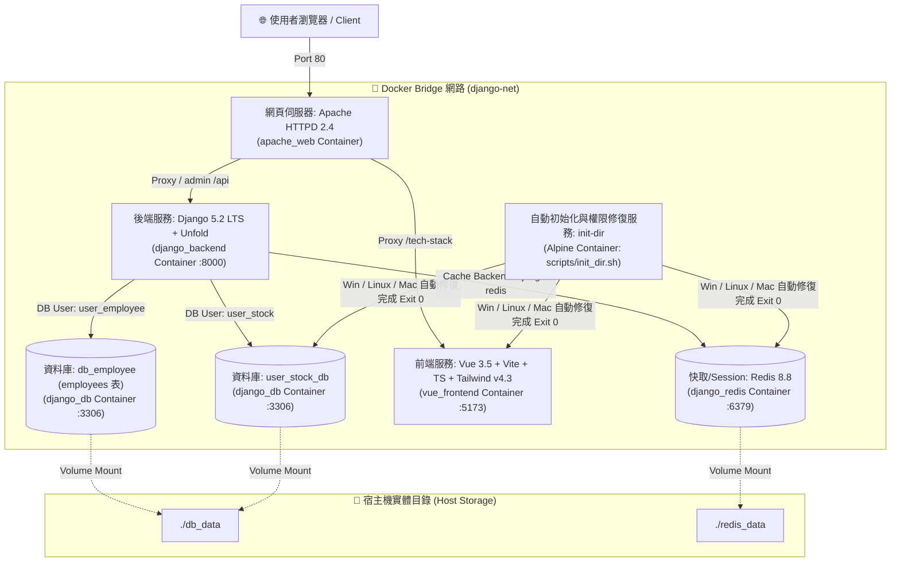
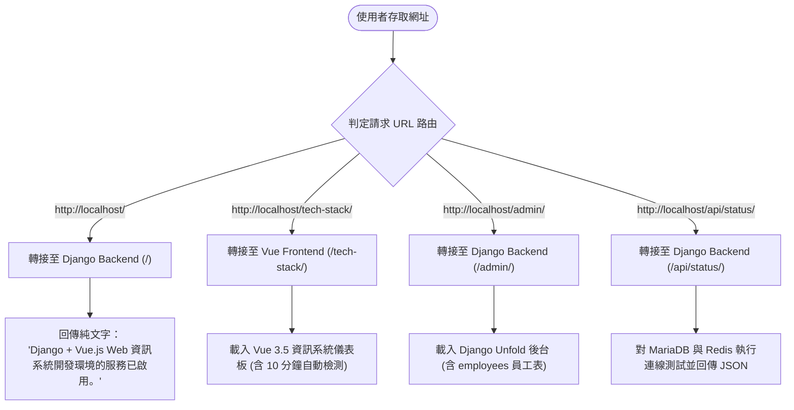

# Django + Vue.js Web 資訊系統開發環境 (Docker Containerized Stack)


本專案提供一套完整且現代化的 **Python Django + Vue.js Web 資訊系統容器化開發環境**。基於 Docker Compose 技術，整合 Apache HTTPD 反向代理、MariaDB 12.3 多關聯式資料庫 (支援多帳號權限隔離與 host 實體目錄掛載 `./db_data`)、Redis 8.8 高併發快取 (掛載 `./redis_data`)、Django 5.2 LTS (搭載 Django Unfold 美觀後台與單元測試套件) 與 Vue 3.5 (搭載 TypeScript 與 Tailwind CSS v4.3 效能引擎)。

---

## 1. 專案簡介 (Description)

本開發環境具備高擴充性、多資料庫隔離、獨立組態與跨平台 (Windows / Linux / macOS) 相容特性，專為中大型 Web 資訊系統開發設計。包含多帳號連線切換、Host OS 自動判斷、全套單元測試與跨平台一鍵自動化部署機制。

### 📊 技術堆疊、工具功能與使用時機對照表

| 組件 / 工具名稱 | 技術堆疊與版本 | 主要功能與服務角色 | 使用時機與存取點 |
| :--- | :--- | :--- | :--- |
| **`init-dir` 服務** | Alpine Linux (`init-dir`) | 自動判斷 Host OS (Win/Linux/Mac) 建立目錄與權限修復 | 容器編排最優先啟動 (Completed Successfully 後觸發其他服務) |
| **Apache HTTPD (`web`)** | Apache HTTPD `2.4-alpine` | 反向代理網頁伺服器，統一 Port 80 進入點 | 處理 `/tech-stack/`, `/`, `/admin/`, `/api/` 路由轉接 |
| **Django Backend (`backend`)** | Python `3.11` + Django `5.2 LTS` | 後端 Web 框架、Unfold 美觀後台、REST API 與單元測試 | 提供根目錄、Unfold、`/api/status/` 端點與單元測試 |
| **Vue Frontend (`frontend`)** | Vue `3.5` + TS + Tailwind `4.3` | 前端 SPA 開發伺服器 (Vite `base: /tech-stack/`) | 造訪 `http://localhost/tech-stack/` 儀表板 (含 10 分鐘自動檢測) |
| **MariaDB (`db`)** | MariaDB `12.3` | 多關聯式 SQL 資料庫 (`user_stock_db`, `db_employee`) | 提供 `user_stock` 與 `user_employee` 雙帳號存取，掛載 `./db_data` |
| **Redis (`redis`)** | Redis `8.8` | 快取與 Session 記憶體資料庫 (持久化至 `./redis_data`) | 處理 Django 高併發 Session 與快取資料存取 |
| **目錄與權限修復腳本** | Shell (`./scripts/init_dir.sh`) | 自動判斷 Windows (NTFS)、macOS (APFS) 或 Linux 原生權限修復 | `init-dir` 容器啟動時自動執行 |
| **跨平台統一部署進入點** | Shell (`./scripts/deploy.sh`) | 跨平台自動偵測 Host OS 並轉接專屬部署與單元測試 | 執行 `./scripts/deploy.sh` (Linux, macOS, Git Bash, WSL) |
| **Windows 平台部署專用** | PowerShell (`./scripts/deploy_windows.ps1`) | Windows 10/11 專屬部署與單元測試流程 (WSL2/NTFS 適配) | 執行 `powershell -ExecutionPolicy Bypass -File ./scripts/deploy_windows.ps1` |
| **Linux 平台部署專用** | Shell (`./scripts/deploy_linux.sh`) | Linux 專屬原生 Docker Engine 高效能部署與單元測試 | 執行 `./scripts/deploy_linux.sh` (Ubuntu / Debian / RHEL) |
| **macOS 平台部署專用** | Shell (`./scripts/deploy_mac.sh`) | macOS 專屬 (Apple Silicon / Intel) 部署與單元測試 | 執行 `./scripts/deploy_mac.sh` |
| **健康測試腳本** | Shell Script (`./scripts/test_health.sh`) | 自動檢測根目錄、API JSON、Vue 200 OK 與 `.env` 變數 | 執行 `./scripts/test_health.sh` 進行線上服務測試 |

---

### 🔗 MariaDB 12.3 多帳號與 Django 5.2 多資料庫協作機制

1. **多帳號與多資料庫 (.env)**：
   - `user_stock` (`user_stock_pass`)：主要資料庫 `user_stock_db` 之擁有者，經授權同時具備 `db_employee` 讀寫權限與全域測試權限。
   - `user_employee` (`user_employee_pass`)：專屬 `db_employee` 之連線帳號。
2. **員工主資料表 (employees)**：
   - 包含工號 (`employee_num`)、姓名、身分證號 (`national_id`)、性別 (`gender`)、主管 (`manager_id`)、狀態 (`status`) 與到職日 (`hire_date`)，容器啟動時自動寫入 10 筆測試資料。
3. **自動初始化目錄與權限修復服務 (`init-dir`)**：
   - Docker Compose 第一優先啟動 `init-dir` 服務 (`scripts/init_dir.sh`)，依據 Host OS 判斷 (Windows NTFS chmod 777 / macOS APFS / Linux chown 999:999 & chmod 777) 自動建立並修復 `./db_data` 與 `./redis_data` 實體目錄權限。
4. **宿主機實體目錄掛載 (`./db_data`)**：
   - `docker-compose.yaml` 內 `django_db` 服務資料儲存目錄嚴格指向專案內實體路徑 `./db_data:/var/lib/mysql`。配置 `innodb_file_per_table = 0` 與 `innodb_use_native_aio = 0` 確保 Windows NTFS / macOS APFS 相容性。
5. **宿主機 OS 自動判斷 (`entrypoint.sh`)**：
   - 容器啟動時會自動判斷 Windows (WSL2)、macOS (LinuxKit) 或 Native Linux 宿主機環境，並調整 ORM Schema 遷移與檔案適配模式。

---

### 系統架構圖 (System Architecture)



### 系統流程圖 (System Flowchart)



---

## 2. 安裝與建置指南 (Installation and Setup)

### 先決條件 (Prerequisites)
- **Docker Engine** 20.10.0+ 
- **Docker Compose** v2.0.0+
- 支援環境：Windows 10/11 (Docker Desktop / WSL2)、Linux (Ubuntu, Debian, RHEL) 或 macOS (Apple Silicon / Intel)

### 步驟 1：複製專案儲存庫
```bash
git clone https://github.com/dengkaitraining/django-on-docker.git
cd django-on-docker
```

### 步驟 2：確認 `.env` 設定檔
確認專案根目錄下 `.env` 檔案已存在，且配置有適當的雙資料庫帳號與密碼：
```bash
cat .env
```

---

## 3. 設定說明 (Configuration)

### 全局環境變數 (`.env`)
```env
# 雙資料庫連線帳號與密碼 (user_stock & user_employee)
DB_NAME=user_stock_db
DB_USER=user_stock
DB_PASSWORD=user_stock_pass

EMPLOYEE_DB_NAME=db_employee
EMPLOYEE_DB_USER=user_employee
EMPLOYEE_DB_PASSWORD=user_employee_pass

# Django 設定與超級管理員
DJANGO_DEBUG=True
DJANGO_ALLOWED_HOSTS=localhost,127.0.0.1,web
DJANGO_SUPERUSER_USERNAME=admin
DJANGO_SUPERUSER_PASSWORD=adminpassword123
```

---

## 4. 執行與啟動本地服務 (Usage / Getting Started)

### 🚀 跨平台一鍵式自動檢測部署與單元測試 (Multi-OS Automated Deployment & Testing)

本專案提供跨平台自動檢測部署與單元測試作業腳本，會自動偵測宿主機 OS 並調配適配模式：

- **統一跨平台進入點 (Linux, macOS, Git Bash, WSL)** : `./scripts/deploy.sh`
- **Linux 平台專用 (Ubuntu / Debian / RHEL)** : `./scripts/deploy_linux.sh`
- **macOS 平台專用 (Apple Silicon / Intel)** : `./scripts/deploy_mac.sh`
- **Windows 平台專用 (PowerShell)** : `powershell -ExecutionPolicy Bypass -File ./scripts/deploy_windows.ps1`

```bash
# 1. 統一跨平台進入點 (Linux, macOS, Git Bash, WSL)
./scripts/deploy.sh

# 2. Linux 平台專用 (Ubuntu / Debian / RHEL)
./scripts/deploy_linux.sh

# 3. macOS 平台專用 (Apple Silicon / Intel)
./scripts/deploy_mac.sh

# 4. Windows 平台專用 (PowerShell)
powershell -ExecutionPolicy Bypass -File ./scripts/deploy_windows.ps1

# 5. 執行 Django 5.2 後端與多資料庫單元測試 (9 項測試)
docker exec django_backend python manage.py test

# 6. 執行線上服務健康檢測
./scripts/test_health.sh
```

### 本地服務連線網址一覽

| 服務模組 | 網址 (URL) | 預設憑證 / 說明 |
| :--- | :--- | :--- |
| **Vue 3.5 前端儀表板** | [http://localhost/tech-stack/](http://localhost/tech-stack/) | 首次自動連線檢測，爾後每 10 分鐘自動重新檢測 |
| **啟用純文字回應** | [http://localhost/](http://localhost/) | 純文字：`Django + Vue.js Web 資訊系統開發環境的服務已啟用。` |
| **Django Unfold 後台** | [http://localhost/admin/](http://localhost/admin/) | 帳號: `admin` \| 密碼: `adminpassword123` (含 `employees` 表) |
| **健康檢查 API** | [http://localhost/api/status/](http://localhost/api/status/) | 回應 MariaDB 與 Redis 連線 JSON 格式數據 |

---

## 5. 資料夾結構與架構簡述 (Project Structure)

```text
.
├── .env                              # 全局環境變數 (含 user_stock & user_employee 憑證)
├── .gitattributes                    # 強制 LF 換行規範 (跨平台支援)
├── .gitignore                        # Git 忽略檔規範
├── docker-compose.yaml               # 6 大容器服務編排檔 (含 init-dir 自動初始化目錄與權限修復服務)
├── README.md                         # 專案詳細說明文件檔
├── scripts/
│   ├── init_dir.sh                  # 自動初始化目錄與跨 OS 權限修復腳本 (init-dir)
│   ├── deploy.sh                     # 統一跨平台進入點 (Linux, macOS, Git Bash, WSL)
│   ├── deploy_linux.sh              # Linux 平台專用部署與單元測試腳本 (Ubuntu / Debian / RHEL)
│   ├── deploy_mac.sh                # macOS 平台專用部署與單元測試腳本 (Apple Silicon / Intel)
│   ├── deploy_windows.ps1            # Windows 平台專用部署與單元測試腳本 (PowerShell)
│   └── test_health.sh                # 線上服務健康測試腳本
├── db_conf/
│   ├── my_custom.cnf                 # MariaDB 參數調校 (innodb_file_per_table=0 NTFS/APFS 相容)
│   └── init_multi_db.sql             # 雙資料庫 (user_stock_db, db_employee) 初始化腳本
├── backend/                          # Django 5.2 後端應用程式
│   ├── Dockerfile
│   ├── entrypoint.sh                 # 自動判斷 Host OS (Windows/Linux/Mac) 與初始化
│   ├── core/
│   │   ├── db_router.py              # 多資料庫路由轉接器 (PrimaryEmployeeRouter)
│   │   ├── settings.py               # 多 DB 設定與 Unfold 配置
│   │   ├── tests.py                  # API 端點、多庫路由與 Redis 快取的單元測試
│   │   └── urls.py                   # 路由配置
│   └── employees/                    # 員工管理模組
│       ├── models.py                 # 員工主資料表 (employees) Model
│       ├── admin.py                  # Unfold ModelAdmin 介面
│       ├── tests.py                  # Employee Model CRUD 與 seed_employees 單元測試
│       └── management/commands/seed_employees.py # 10 筆測試員工生成指令
├── frontend/                         # Vue 3.5 前端應用程式
│   └── src/App.vue                   # 前端 Dashboard 介面 (10 分鐘自動檢測)
├── db_data/                          # MariaDB 12.3 實體目錄持久化區 (Git 忽略)
└── redis_data/                       # Redis 8.8 實體目錄持久化區 (Git 忽略)
```

---

## 6. 系統測試與驗證 (System Testing and Verification)

### 測試檢核項目清單

| 測試項目 | 測試標的與指令 | 檢驗標準與預期結果 | 通過狀態 |
| :--- | :--- | :--- | :--- |
| **統一進入點部署** | `./scripts/deploy.sh` | 自動偵測系統、執行 Docker 構建與單元測試並驗證健康 API | **✓ 通過 (Exit 0)** |
| **Linux 專用部署** | `./scripts/deploy_linux.sh` | Linux 原生高效能部署與單元測試全數通過 | **✓ 通過 (Exit 0)** |
| **macOS 專用部署** | `./scripts/deploy_mac.sh` | 架構辨識、APFS 掛載適配、單元測試通過並完成 API 健康驗證 | **✓ 通過 (Exit 0)** |
| **Windows 專用部署** | `powershell -ExecutionPolicy Bypass -File ./scripts/deploy_windows.ps1` | Docker 構建、自動啟動、單元測試通過並完成 API 健康驗證 | **✓ 通過 (Exit 0)** |
| **Django 單元測試** | `docker exec django_backend python manage.py test` | 9 項單元測試 (API 端點, 多庫路由, Redis 快取, Employee CRUD, 種子指令) 全數通過 | **✓ 通過 (Ran 9 tests OK)** |
| **根目錄檢查** | `curl -s http://localhost/` | 網頁出現 `Django + Vue.js Web 資訊系統開發環境` 的文字 | **✓ 通過 (200 OK)** |
| **API 端點檢查** | `curl -s http://localhost/api/status/` | JSON 檔返回 `database` 與 `redis` 皆為 `"connected"` 成功訊息 | **✓ 通過 (200 OK)** |
| **頁面功能檢查** | `curl -sI http://localhost/tech-stack/` | `/tech-stack/` 回應 HTTP 200，出現所有技術堆疊圖標與儀表板卡片 | **✓ 通過 (200 OK)** |
| **自動化健康測試** | 執行 `./scripts/test_health.sh` | 終端機顯示 `🎉 所有自動化健康測試均完全通過!` | **✓ 通過 (Exit 0)** |
| **環境變數檢查** | 檢查 `.env` 設定檔 | 確認是否有設定 `DJANGO_DEBUG=True` 與 `DJANGO_ALLOWED_HOSTS` 包含 `localhost` 或 `*` | **✓ 通過** |

---

## 7. 貢獻與授權 (Contributing and License)

### 貢獻指南 (Contributing)
歡迎提交 Issue 或 Pull Request 以改進此模板。在提交程式碼前，請確保：
1. Shell 腳本維持 Unix `LF` 換行格式，且執行單元測試 `docker exec django_backend python manage.py test` 全數通過。
2. 保持程式碼與設定檔中繁體中文註解與多資料庫說明的完整性。

### 授權協定 (License)
本專案採用 [MIT License](LICENSE) 授權釋出。
